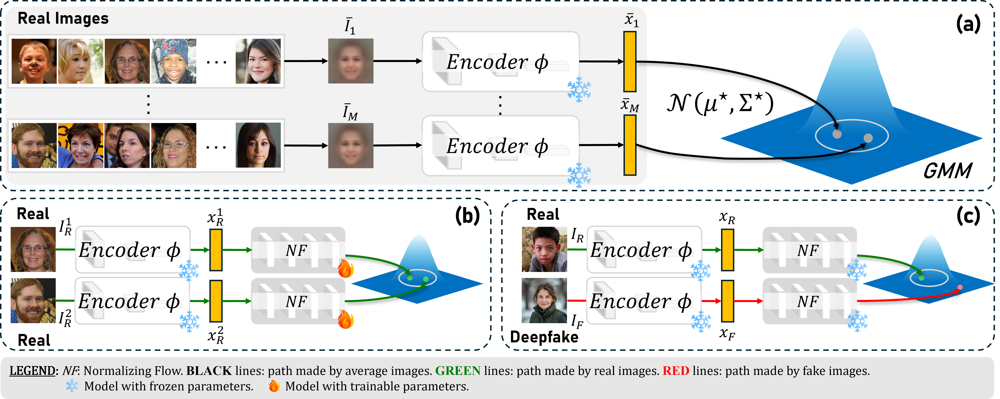
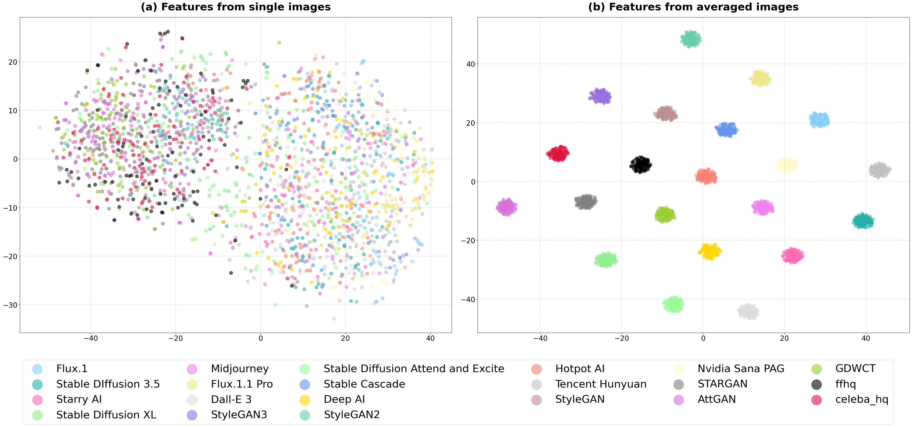

# µFlow — Leveraging Average Images for Improving Generalisation of Deepfake Faces Detectors

> One-class deepfake **face** detector trained **only on real images** — no fake images, no
> pseudo-deepfakes, no synthetic artifacts.
> *Under review at ECCV 2026.*

µFlow builds on a simple observation: **averaging many real images amplifies the consistent
low-level traces** of a source, producing a feature space where real and fake samples are highly
separable. We model the distribution of features extracted from *average* real images with a
**Gaussian Mixture Model (GMM)**, and train a **normalizing flow (FastFlow)** to map the features
of *single* real images into that discriminative distribution. At inference, real images land in
high-likelihood regions while fakes fall in low-likelihood regions — the negative log-likelihood is
used directly as an **anomaly (fakeness) score**.

Because it never sees fake data during training, µFlow generalises strongly to **unseen
generators** (GANs *and* diffusion models). It is trained on **FFHQ** reals and evaluated on
**CelebA-HQ** reals plus **19 unseen generators** from the **WILD** dataset.

<p align="center">
  
</p>

---

## How it works

The pipeline has three stages:

1. **Discriminative Space Learning** — extract features from *average* real images and fit a GMM:
   the target latent distribution `N(µ*, Σ*)`.
2. **FastFlow Training** — train a normalizing flow on features of *single* real images,
   maximising their likelihood under the GMM (minimising the Gaussian NLL).
3. **Inference** — the NLL of a test image is its anomaly score. A threshold, calibrated on
   held-out real images, separates real from fake.

<p align="center">
  
</p>
<p align="center">
  <em>(a) Discriminative space learning from average real images · (b) FastFlow training on single
  real images · (c) likelihood-based inference.</em>
</p>

The core intuition: **averaging images amplifies generative traces**. Features of *single* images
overlap across sources, but features of their *averages* form well-separated clusters — a far more
discriminative space for deepfake detection.

<p align="center">
  
</p>
<p align="center">
  <em>t-SNE of features from single images (left) vs averaged images (right).</em>
</p>

---

## Repository layout

```
MuFlow/
├── main.py                     
├── eval.py                     
├── preds_analysis.py
├── configs/
├── scripts/
│   ├── generate_means.py       
│   ├── generate_parameters.py  
│   ├── generate_csv.py         
│   └── analyze_means.py        
└── src/muflow/                 
    ├── model.py                
    ├── dataset.py              
    ├── attacks.py              
    ├── constants.py            
    └── gpu_utils.py
```

---

## Installation

Requires **Python ≥ 3.12** and a CUDA-capable GPU (CPU works but is slow).

```bash
git clone https://github.com/opontorno/MuFlow.git
cd MuFlow

# (recommended) create an environment
conda create -n muflow python=3.12 -y
conda activate muflow

# install the package and its dependencies
pip install -e .
```

This installs, among others, **FrEIA** (normalizing flows) and the official **OpenAI CLIP**
package (`clip`), both from Git. If you only use CNN/DINOv2 backbones you do not need CLIP at
runtime.

---

## Configuring paths

All paths are read from `src/muflow/constants.py` and can be overridden with environment variables
— **no need to edit the source**:

| Variable                | Meaning                          | Default        |
|-------------------------|----------------------------------|----------------|
| `MUFLOW_DATA_DIR`       | Root of your datasets            | *(set this!)*  |
| `MUFLOW_WORKING_DIR`    | Repo root                        | auto-detected  |
| `MUFLOW_CHECKPOINT_DIR` | Where training runs are written  | `logs/`        |

```bash
export MUFLOW_DATA_DIR=/path/to/your/data
```

### Expected data layout

`$MUFLOW_DATA_DIR` should contain real and fake faces. The default configuration trains on FFHQ
reals and evaluates on CelebA-HQ + WILD/DFX fakes:

```
$MUFLOW_DATA_DIR/
├── ffhq/<sub>/*.png                   # real (training source)
├── celeba_hq/{train,val}/<sub>/*.jpg  # real (OOD real at test time)
├── WILD/<set>/<generator>/*.png       # fake generators (test)
├── datasets_DFX/<generator>/*.png     # additional fakes (test)
├── dataset_split_rand.csv             # train/val/test split (see Step 0)
└── means/<mean_size>/<source>/*.png   # average images (see Step 1)
```

You can point µFlow at **your own** datasets: any folder of real face images works as the training
source, and any folder of generators works as the test set — adjust the globs in
`src/muflow/dataset.py` accordingly.

---

## End-to-end usage

### Step 0 — Build the split CSV

The dataset uses a CSV (`$MUFLOW_DATA_DIR/dataset_split_rand.csv`) with columns `path,split`
(`train`/`val`/`test`). Generate it once:

```bash
python scripts/generate_csv.py
```

### Step 1 — Compute average images (of your real dataset)

µFlow's discriminative space is built from **average images**. For training you only need the
averages of your **real** dataset. Edit `INPUT_GLOB` at the top of
`scripts/generate_means.py`, then run:

```bash
# e.g. INPUT_GLOB = "/path/to/ffhq/**/*.png"
python scripts/generate_means.py --name ffhq --mean-size 500 --num-images 1000
```

This writes `…/means/500/ffhq/*.png` (each image is the average of 500 random reals). Run it once
per source you want to include (it works for any image set, not just reals).

### Step 2 — Fit the GMM

```bash
python scripts/generate_parameters.py --model_name resnet50 --reals ffhq
```

This reads the average images, extracts backbone features and saves the GMM parameters under
`parameters/`. **You can skip this step**: `main.py` runs it automatically if the parameters file
is missing.

### Step 3 — Train

```bash
python main.py --config configs/resnet50.yaml --data WILD --reals ffhq
```

Useful flags:

| Flag | Description | Default |
|------|-------------|---------|
| `--config` | backbone YAML | `configs/resnet50.yaml` |
| `--reals` | training real source (`ffhq`, `celeba_hq`, `ffhq+celeba_hq`) | `ffhq` |
| `--batch_size`, `--lr`, `--num_epochs` | optimisation | `32`, `1e-4`, `1000` |
| `--alpha` | target false-positive rate for the threshold | `0.1` |
| `--gpu_id` | force a GPU (default: auto-select the freest) | auto |
| `--wandb` | `online` / `offline` / `disabled` | `online` |
| `--wandb_entity`, `--wandb_project` | W&B destination | your default / `MuFlow` |

Each run writes a checkpoint (`best.pt`), the calibrated thresholds, predictions and a metrics
JSON to `$MUFLOW_CHECKPOINT_DIR/<run_name>/`. The best run is promoted to a canonical folder.

> Tip: pass `--wandb disabled` to run without Weights & Biases.

### Step 4 — Evaluate

```bash
python eval.py --run_dir logs/<canonical_run_name>
```

All settings are loaded from the run's `run_config.yaml`. You can also evaluate on custom folders:

```bash
python eval.py --run_dir logs/<run> \
    --custom_dirs /path/reals /path/fakes --custom_labels 0 1
```

Robustness to degradations (JPEG, blur, Gaussian/salt-&-pepper noise, resize, flip, …) can be
toggled in the `attacks_configs` list inside `eval.py`.

### Step 5 (optional) — Feature analysis

Reproduce the paper's t-SNE analysis (single-image features vs their averages, side by side, per
layer). Edit `SINGLE_IMAGE_GLOBS` at the top of `scripts/analyze_means.py`, then:

```bash
python scripts/analyze_means.py --model_name resnet50 --means-dir $MUFLOW_DATA_DIR/means/500
```

Plots are saved to `scripts/.pictures/`.

---

## Backbones

Select a backbone via its config in `configs/`. Supported families:

- **CNN** (ImageNet): `resnet18/50/101`, `wide_resnet50_2`, `densenet121`
- **ViT** (ImageNet): `deit`, `cait`
- **DINOv2**: `dinov2_vits14/vitb14/vitl14`
- **CLIP** (OpenAI): `clip_vitb32`, `clip_vitb16`, `clip_vitl14`

Input normalisation is handled automatically per backbone (`constants.get_norm_stats`): CLIP uses
CLIP statistics, everything else uses ImageNet statistics — and the **exact same** normalisation is
applied during GMM fitting, training, evaluation and analysis.

---

## Results

In a fully **out-of-distribution** setting (trained on FFHQ reals only; tested on unseen CelebA-HQ
reals and **19 unseen generators** from WILD), µFlow reaches, on average:

| Metric | Clean | Under degradations |
|--------|:-----:|:------------------:|
| Accuracy | **96.8%** | 90.9% |
| AUC | **96.1%** | 91.5% |
| Avg. Precision | **96.8%** | 90.4% |

See the paper for full per-generator and robustness tables.

---

## Citation

```bibtex
@inproceedings{pontorno2026muflow,
  title     = {{\textmu}Flow: Leveraging Average Images for Improving
               Generalisation of Deepfake Faces Detectors},
  author    = {Pontorno, Orazio and Litrico, Mattia and
               Guarnera, Luca and Giuffrida, Valerio and
               Battiato, Sebastiano},
  booktitle = {Under Review at ECCV 2026},
  year      = {2026},
}
```

## License

Released under the terms in [LICENSE](LICENSE).
