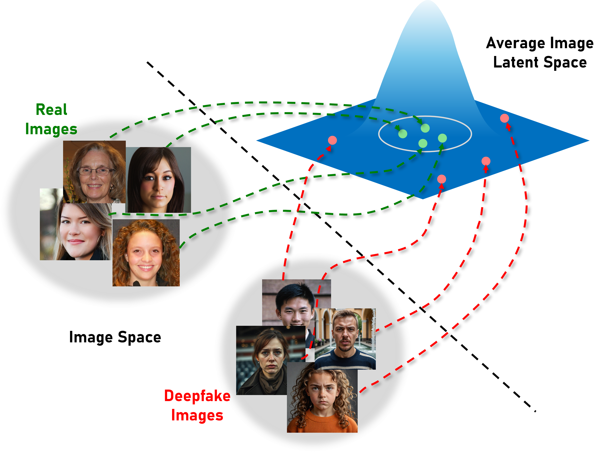

<h1 align="center">µFlow — Leveraging Average Images for Improving Generalisation of Deepfake Faces Detectors</h1>

<p align="center">
  
  
  <a href="https://opontorno.github.io/MuFlow/"></a>
</p>

<p align="center">
  <b>One-class deepfake face detector trained only on real images.</b> &nbsp;·&nbsp; <b>Accepted at ECCV 2026.</b>
</p>

<p align="center">
  
</p>

µFlow is a one-class deepfake detector trained **only on real images**. It models the distribution
of features extracted from *average* real images with a **Gaussian Mixture Model (GMM)**, and trains
a **normalizing flow (FastFlow)** to map the features of *single* real images into that
distribution. At inference, the negative log-likelihood of an image is used directly as a fakeness
score.

> This repository documents **how to train and test the model**. For the method description,
> experiments and results, see the **[project page](https://opontorno.github.io/MuFlow/)**.

---

## Repository layout

```
MuFlow/
├── config.py                   # dataset, families & reporting configuration
├── main.py                     # training entry point
├── eval.py                     # evaluation (robustness attacks & custom dirs)
├── configs/                    # one YAML per model config
├── data/                       # split CSV lives here
├── scripts/                    # dataset & GMM preparation
└── src/muflow/                 # the reusable library (model & method only)
    ├── model.py                # FastFlow model & backbone builder
    ├── dataset.py              # data loading & transforms
    ├── patch_utils.py          # native-patch sampling & feature extraction
    ├── calibration.py          # threshold calibration & sweep
    ├── attacks.py              # content-preserving degradations
    ├── constants.py            # backbone & normalisation specs
    └── gpu_utils.py            # automatic GPU selection
```

---

## Installation

Requires **Python ≥ 3.12** and a CUDA-capable GPU.

```bash
git clone https://github.com/opontorno/MuFlow.git
cd MuFlow

conda create -n muflow python=3.12 -y
conda activate muflow

pip install -e .
```

---

## Configuring the datasets

All dataset and reporting settings live in **`config.py`** at the repo root — adapt it to your
data without touching the library.

`MUFLOW_DATA_DIR` is **required**: `config.py` raises immediately if it isn't set (either export
it, or hardcode `DATA_DIR` directly in `config.py`):

```bash
export MUFLOW_DATA_DIR=/path/to/your/data
```

The core of it is three glob patterns, shown below with the values **this project** uses for its
own experiments — edit them to match **your own** folders and file names (there is no mandatory
folder structure; a glob that matches nothing raises a clear error naming the offending pattern):

```python
PATH_REAL     = [f"{DATA_DIR}/datasets/ffhq/**/*.*g"]        # train / val / calibration
PATH_REAL_OOD = [f"{DATA_DIR}/datasets/celeba_hq/**/*.*g"]   # test baseline (None → reuse PATH_REAL)
PATH_FAKE     = [f"{DATA_DIR}/datasets/WILD/**/*.*g", ...]    # fake generators (test only)
```

`config.py` also holds the generator **families** (for the per-family report), the console
**reporting** flags, and the dataset-**prep** knobs (mean size, per-class cap, split ratios) — adjust
the family names to match your own fake-generator folders.

For reference, the layout **this project** uses is the following — but any other arrangement works
just as well, as long as `config.py` points at it:

```
$MUFLOW_DATA_DIR/
├── datasets/
│   ├── ffhq/<sub>/*.png                        # real — training source
│   ├── celeba_hq/{train,val}/<sub>/*.jpg       # real — test-time baseline
│   ├── WILD/{Closed_Set,Open_Set}/<gen>/*.png  # fake generators
│   └── other_sources/<gen>/*.png               # fake generators
└── datasets_means/<mean_size>/<source>/*.png   # average images

MuFlow/data/dataset_split_rand.csv              # train/val/test split
```

---

## Training

### Step 0 — Build the split CSV

The dataset is indexed by a CSV (`data/dataset_split_rand.csv`, columns `path,split`):

```bash
python scripts/generate_csv.py
```

### Step 1 — Compute average images

Compute the average images of the real source (taken from `PATH_REAL` by default):

```bash
python scripts/generate_means.py
```

Pass `--input <glob> --name <folder>` to average a different source.

### Step 2 — Fit the GMM

```bash
python scripts/generate_parameters.py
```

This step is optional: `main.py` runs it automatically if the parameters file is missing.

### Step 3 — Train

```bash
python main.py
```

Each run writes a checkpoint (`best.pt`), the calibrated thresholds, predictions and a metrics
JSON to `$MUFLOW_CHECKPOINT_DIR/<run_name>/`.

---

## Testing

```bash
python eval.py --run_dir logs/<run_name>
```

Settings are loaded from the run's `run_config.yaml`. You can also evaluate on custom folders:

```bash
python eval.py --run_dir logs/<run> \
    --custom_dirs /path/reals /path/fakes --custom_labels 0 1
```

---

## Citation

If you find this work useful, please consider citing:

```bibtex
@inproceedings{pontorno2026mu,
  title={{{$\mu$Flow}: Leveraging Average Images for Improving Generalisation of Deepfake Faces Detectors}},
  author={Pontorno, Orazio and Litrico, Mattia and Guarnera, Luca and Giuffrida, Mario Valerio and Battiato, Sebastiano},
  booktitle={European Conference on Computer Vision},
  year={2026},
  organization={Springer}
}
```

---

## Contact

**Orazio Pontorno** — University of Catania — [orazio.pontorno@phd.unict.it](mailto:orazio.pontorno@phd.unict.it)

---

## License

See [LICENSE](LICENSE).
